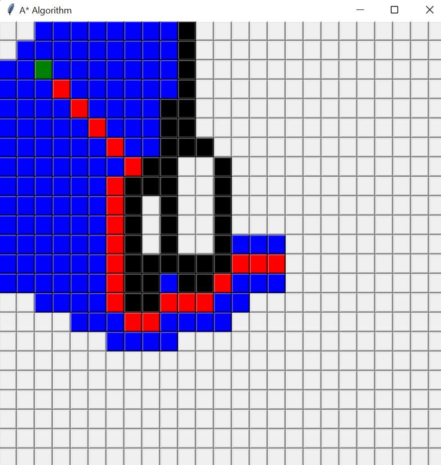

# A* Algorithm Implementation with Tkinter

## Overview

Embark on a journey through the implementation of the A* pathfinding algorithm, seamlessly woven into the fabric of Python's Tkinter package. A testament to efficiency in graph traversal, this algorithm elegantly balances heuristic functions and node costs to pave the way from start to goal.

# The Code implementation

```python
from tkinter import *
from functools import partial
from time import sleep
from PIL import Image, ImageGrab


def center_gui(root):

    
    windowWidth = root.winfo_reqwidth()
    windowHeight = root.winfo_reqheight()

    
    positionRight = int(root.winfo_screenwidth()/2 - windowWidth/2)
    positionDown = int(root.winfo_screenheight()/2 - windowHeight/2)

    root.geometry("+{}+{}".format(positionRight, positionDown))


def pop_up_window(app):
    """
    Displays the start up window with the instructions.
    When the pop up is displayed the buttons at the backround
    are disabled
    """

    def start_button_action():

        app.enable_buttons()
        win.destroy()

    win = Toplevel()
    win.wm_title("Welcome")

    Label(win, text="Step 1: Select starting point",
          font=("Calibri", 13), pady=5, padx=10).pack()
    Label(win, text="Step 2: Select end point", font=(
        "Calibri", 13), pady=5, padx=10).pack()
    Label(win, text="Step 3: Select Obstacles", font=(
        "Calibri", 13), pady=5, padx=10).pack()
    Label(win, text="Click and hover.Then click again to stop", padx=25).pack()
    Label(win, text="Step 4: Press Enter to start",
          font=("Calibri", 13), pady=5, padx=10).pack()
    Label(win, text="Step 5: Press R to restart",
          font=("Calibri", 13), pady=5, padx=10).pack()
    Button(win, text="Start", command=start_button_action,
           ).pack()

    win.update_idletasks()
    center_gui(win)


class App:

    def __init__(self, master):

        self.master = master
        master.wm_title("A* Algorithm")
        self.buttons = []
        self.start = []
        self.goal = []
        self.obstacles = []
        self.mode = 0

        for i in range(25):
            self.buttons.append([])
            for j in range(25):

                
                button = Button(master, width=2, height=1,
                                command=partial(self.button_operation, i, j), state="disabled")

                self.buttons[i].append(button)

                
                self.buttons[i][j].bind('<Enter>', partial(
                    self.add_obstacle, i, j))

                self.buttons[i][j].grid(row=i, column=j)

        master.update_idletasks()
        center_gui(master)

        pop_up_window(self)

    def enable_buttons(self):

        for i in range(25):
            for j in range(25):
                self.buttons[i][j].configure(state="normal")

    def disable_buttons(self):

        for i in range(25):
            for j in range(25):
                self.buttons[i][j].configure(state="disable")


    def button_operation(self, row, column):
        """
        According to the value of 'mode' this fuction
        sets the value of start and end. Also by changing
        the value of mode it controls when we can set obstacles and
        when we can start the algorithm
        """

        
        if self.mode == 0:

            self.start.append(row)
            self.start.append(column)
            self.mode = 1
            self.buttons[row][column].configure(bg='green')

       
        elif self.mode == 1:

            self.goal.append(row)
            self.goal.append(column)
            self.mode = 2
            self.buttons[row][column].configure(bg='red')

        elif self.mode == 2:

            
            self.mode = 3

        else:
           
            self.mode = 2

    def add_obstacle(self, row, column, event):

       
        if self.mode == 3:
            obstacle_node = []
            obstacle_node.append(row)
            obstacle_node.append(column)

            self.obstacles.append(obstacle_node[:])
            self.buttons[row][column].configure(bg='black')

    def heuristic(self, node1, node2):
        result = abs(node1[0] - node2[0]) + abs(node1[1]-node2[1])
        return result

    def find_neighbors(self, current, obstacles):

        neighbors = []

        

        right_neighbor = current[:]
        right_neighbor[1] = current[1] + 1

        if 0 <= right_neighbor[1] < 25 and right_neighbor not in self.obstacles:
            neighbors.append(right_neighbor)

        left_neighbor = current[:]
        left_neighbor[1] = current[1] - 1

        if 0 <= left_neighbor[1] < 25 and left_neighbor not in self.obstacles:
            neighbors.append(left_neighbor)

        up_neighbor = current[:]
        up_neighbor[0] = current[0] + 1

        if 0 <= up_neighbor[0] < 25 and up_neighbor not in self.obstacles:

            neighbors.append(up_neighbor)

        down_neighbor = current[:]
        down_neighbor[0] = current[0] - 1

        if 0 <= down_neighbor[0] < 25 and down_neighbor not in self.obstacles:

            neighbors.append(down_neighbor)

        down_right_neighbor = current[:]
        down_right_neighbor[0] = current[0] + 1
        down_right_neighbor[1] = current[1] + 1

        if 0 <= down_right_neighbor[0] < 25 and 0 <= down_right_neighbor[1] < 25 and down_right_neighbor not in self.obstacles:
            neighbors.append(down_right_neighbor)

        up_right_neighbor = current[:]
        up_right_neighbor[0] = current[0] - 1
        up_right_neighbor[1] = current[1] + 1

        if 0 <= up_right_neighbor[0] < 25 and 0 <= up_right_neighbor[1] < 25 and up_right_neighbor not in self.obstacles:

            neighbors.append(up_right_neighbor)

        up_left_neighbor = current[:]
        up_left_neighbor[0] = current[0] - 1
        up_left_neighbor[1] = current[1] - 1

        if 0 <= up_left_neighbor[0] < 25 and 0 <= up_left_neighbor[1] < 25 and up_left_neighbor not in self.obstacles:

            neighbors.append(up_left_neighbor)

        down_left_neighbor = current[:]
        down_left_neighbor[0] = current[0] + 1
        down_left_neighbor[1] = current[1] - 1

        if 0 <= down_left_neighbor[0] < 25 and 0 <= down_left_neighbor[1] < 25 and down_left_neighbor not in self.obstacles:
            neighbors.append(down_left_neighbor)

        return neighbors

    def sort_open_set(self, open_set, f_score):

        
        index_to_fscore = []

        for node in open_set:
            f_score_of_node = f_score[node[0]][node[1]]
            index_to_fscore.append(f_score_of_node)

        sorted_copy = index_to_fscore.copy()
        sorted_copy.sort()

        sorted_open_set = []

        for value in sorted_copy:
            min = index_to_fscore.index(value)
            sorted_open_set.append(open_set[min])
            
            index_to_fscore[min] = float('inf')

        return sorted_open_set

    def reconstruct_path(self, cameFrom, current):
        total_path = []

        while current != self.start:

            self.buttons[current[0]][current[1]].configure(bg='red')

            total_path.append(current[:])
            current = cameFrom[current[0]][current[1]]

    def a_star_algorithm(self, start, goal):

        open_set = [start]
        g_score = []
        f_score = []
        came_from = []

      
        for i in range(25):
            f_score.append([])
            g_score.append([])
            came_from.append([])
            for j in range(25):
                temp = float('inf')
                came_from[i].append([])
                g_score[i].append(temp) 
                f_score[i].append(temp)  

        g_score[start[0]][start[1]] = 0
        f_score[start[0]][start[1]] = self.heuristic(start, goal)

        while len(open_set) > 0:
            self.master.update_idletasks()
            sleep(0.02)

            open_set = self.sort_open_set(open_set, f_score)

            current = open_set[0]
            current_row = current[0]
            current_column = current[1]

            if current == goal:
                return self.reconstruct_path(came_from, current)

            open_set.remove(current)

            neighbors = self.find_neighbors(current, [])

            for node in neighbors:

                node_row = node[0]
                node_column = node[1]

                
                tentative_gScore = g_score[current_row][current_column] + 1

                if tentative_gScore < g_score[node_row][node_column]:

                    came_from[node_row][node_column].append(current_row)
                    came_from[node_row][node_column].append(
                        current_column)

                    g_score[node_row][node_column] = tentative_gScore

                    f_score[node_row][node_column] = g_score[node_row][node_column] + \
                        self.heuristic(node, self.goal)

                    if node not in open_set:

                        self.buttons[node[0]][node[1]].configure(bg='blue')
                        open_set.append(node[:])

        print("couldn't reach the target!")

    def find_path(self, event):

        
        if self.mode == 2:
            self.a_star_algorithm(self.start, self.goal)
            self.disable_buttons()

    def reset(self, event):

        if self.mode == 2:
            self.start = []
            self.goal = []
            self.obstacles = []
            self.mode = 0

            for i in range(25):
                for j in range(25):

                    self.buttons[i][j].configure(bg='SystemButtonFace')

            self.enable_buttons()


if __name__ == '__main__':
    root = Tk()
    app = App(root)

   
    root.bind('<Return>', app.find_path)
    root.bind('r', app.reset)

    root.mainloop()
```

## Technical Nuances

Picture a 25x25 grid, where each square signifies a strategic step. The dance of movement, be it vertical, horizontal, or diagonal, is choreographed with a uniform cost of one. Enter the heuristic luminary, the square Manhattan distance, shaping the algorithm's perception of cost-effectiveness.

**Manhattan Distance Illuminated:**
\[ \text{Manhattan Distance} = | x_1 - x_2 | + | y_1 - y_2 | \]

The algorithm gracefully pirouettes through procedural steps, mirroring the pseudocode symphony found on the revered Wikipedia stage.

[Pseudocode Waltz](https://en.wikipedia.org/wiki/A*_search_algorithm)

## Visual Symphony

The denouement unfolds on a Tkinter canvas, a graphical interface orchestrating the A* algorithm. Each pixel on the grid narrates the algorithm's saga—decision-making in real-time, navigating obstacles, and embracing the allure of the least costly path.

<div style="text-align:center;">
  
</div>

## Dance of Interaction

Engaging with the canvas is akin to a pas de deux:

1. **Choose the Origin:**
   - A click designates the starting point, setting the stage for the algorithmic performance.

2. **Navigate to Destiny:**
   - A second click establishes the endpoint, where the algorithm aims to deliver its protagonist.

3. **Obstacles as Props:**
   - Click and hover to summon obstacles, a ballet of hindrances. Click again to conclude the obstacle interlude.

4. **Commence Algorithmic Overture:**
   - The 'Enter' key initiates the algorithm, a crescendo of computation unfolding on the stage.

5. **Encore, Restart:**
   - The 'R' key commands a restart, an invitation to craft a new narrative with fresh starting and ending points.

**Note:**
- Obstacle embellishment is optional; the algorithm gracefully proceeds with only the start and goal in focus.
- Witness the algorithm's choreography, unraveling the optimal path with each calculated step.

This implementation beckons exploration, offering a visually enthralling saga of the A* algorithm. Users are not just spectators; they are active participants, guiding the algorithm through a ballet of points and paths.
